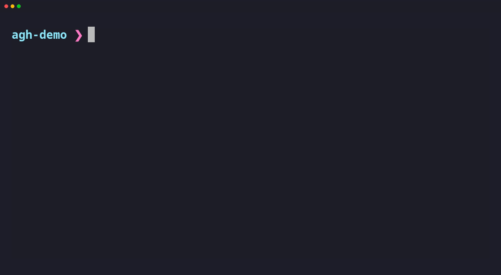

<div align="center">

# Agent Guidance Hub (AGH)

<p><strong>Self-hosted guidance distribution for coding agents.</strong></p>

<p>
  <a href="https://pypi.org/project/agh/"></a>
  <a href="https://github.com/giulianotesta7/AgentGuidanceHub/pkgs/container/agent-guidance-hub"></a>
  <a href="https://github.com/giulianotesta7/AgentGuidanceHub/actions/workflows/ci.yml"></a>
  <a href="https://github.com/giulianotesta7/AgentGuidanceHub/releases"></a>
</p>

<p>
  <a href="#install">install</a> · <a href="#quick-start">quick start</a> · <a href="#how-agh-works">how it works</a> · <a href="#server-operations">server ops</a> · <a href="#development">development</a> · <a href="README.es.md">español</a>
</p>

</div>

[Español](README.es.md)

---



**AGH gives teams one place to publish, version, assign, and pull reusable agent instructions and skills into their repos.**

Use it when agent guidance needs the same discipline as infrastructure: reproducible changes, clear ownership, and self-hosted runtime. AGH is early, Docker-first, and published as a PyPI package, Homebrew formula, and GHCR server image.

- **Centralize guidance**: publish shared `AGENTS.md`, `CLAUDE.md`, and skill files once.
- **Version every change**: packs are immutable SemVer releases assigned to projects.
- **Keep repos deterministic**: each workspace records `.agh/lock.toml` and applies only the selected agent target.
- **Run it yourself**: host the server with Docker, SQLite, and persistent `/data` storage.

---

## Install

Linux / macOS:

```bash
brew install giulianotesta7/tap/agh
```

or install with script:

```bash
curl -fsSL https://raw.githubusercontent.com/giulianotesta7/AgentGuidanceHub/main/scripts/install.sh | sh
```

or install with uv:

```bash
uv tool install --force agh
```

from a checkout:

```bash
git clone https://github.com/giulianotesta7/AgentGuidanceHub.git
cd AgentGuidanceHub
uv tool install --force .
```

check the CLI:

```bash
agh --help
```

Run the server with the published Docker image:

```bash
docker compose up -d
curl http://127.0.0.1:8912/api/v1/health
```

The default Compose image is:

```text
ghcr.io/giulianotesta7/agent-guidance-hub:${AGH_IMAGE_TAG:-latest}
```

Pin production deployments with a release tag:

```bash
AGH_IMAGE_TAG=0.2.0 docker compose up -d
```

## Quick start

Read the first owner token on the host running AGH:

```bash
docker run --rm -v agh-data:/data busybox \
  cat /data/secrets/initial_owner_token
```

Then log in from your machine:

```bash
agh login \
  --url <instance-url> \
  --email owner@example.com \
  --token "<initial-owner-token>"
```

Check the saved config. AGH masks the token:

```bash
agh config show
```

Create a project with the repo URL developers use in git remotes:

```bash
agh project create "Agent Guidance Hub" \
  --repo-url https://github.com/giulianotesta7/AgentGuidanceHub.git
```

Work from a linked repo:

```bash
agh sync
agh agent select opencode # or: agh agent select claude
agh pull --dry-run
agh pull
agh agent
agh agent show
```

## How AGH works

```text
Pack author ── publish ──▶ AGH server ── assign ──▶ Project
                              │                         │
                              │                         ▼
                         SQLite + /data          Repo workspace
                                                       │
                                                       ├─ AGENTS.md + .opencode/skills/
                                                       └─ CLAUDE.md + .claude/skills/
```

| Piece | What it does |
|-------|--------------|
| Packs | Shared instructions, skills, or both. Published versions are immutable. |
| Projects | One git repository plus the pack versions it should use. |
| Workspaces | A local repo linked with `agh sync`, one selected agent, and a committed lockfile. |

<details>
<summary><strong>Pack authoring</strong></summary>

A pack starts with this shape:

```text
my-pack/
├── agh.pack.toml
├── instructions/
│   ├── AGENTS.md
│   └── CLAUDE.md
└── skills/
    └── reviewer/
        └── SKILL.md
```

Create a template:

```bash
agh pack init ./my-pack --domain acme --name onboarding --version 1.0.0
```

The manifest starts as:

```toml
domain = "acme"
name = "onboarding"
version = "1.0.0"
description = "TODO"
```

Useful starter flags:

- `--with-agents` creates `instructions/AGENTS.md`.
- `--with-claude` creates `instructions/CLAUDE.md`.
- `--with-skill NAME` creates `skills/NAME/SKILL.md`.

Allowed files:

- `agh.pack.toml`
- `instructions/AGENTS.md`
- `instructions/CLAUDE.md`
- `skills/<name>/SKILL.md`

Rules:

- A pack can contain instructions, skills, or both.
- It must include at least one instruction file or skill.
- `version` must be exact SemVer, such as `1.0.0`.
- Published versions are immutable. Publish `1.0.1` for changes.
- Do not publish `latest`. Use `latest` only when assigning packs to projects.
- Use UTF-8 text files. Do not include symlinks.

Publish and list packs:

```bash
agh pack publish ./my-pack
agh pack list
```

Example publish output:

```text
Published acme/onboarding@1.0.0.
Pack ID: pack_...
Checksum: sha256:...
```

</details>

<details>
<summary><strong>Project assignment</strong></summary>

A project is an AGH record linked to one git repository.

```bash
agh project create "Agent Guidance Hub" \
  --repo-url https://github.com/giulianotesta7/AgentGuidanceHub.git
agh project list
agh project get prj_...
agh project update prj_... --name "App API"
agh project delete prj_...
```

Assign packs to a project:

```bash
agh project pack add prj_... acme/onboarding@latest
agh project pack list prj_...
agh project pack update prj_... asn_... --pack-ref acme/onboarding@1.0.0
agh project pack remove prj_... asn_...
```

`asn_...` identifies the project-to-pack assignment. Use an exact version to pin the project. Use `latest` when the project should resolve to the newest published version during pull.

During workspace pull, AGH writes the resolved concrete version and checksum to `.agh/lock.toml`.

</details>

<details>
<summary><strong>Workspace pull and Git state</strong></summary>

| Command | What it does |
|---------|--------------|
| `agh sync` | Matches the git remote to an AGH project and writes `.agh/project.toml`. |
| `agh agent` / `agh agent show` | Shows Claude Code/OpenCode availability and the current local selection. |
| `agh agent select claude` | Selects Claude Code for this workspace. |
| `agh agent select opencode` | Selects OpenCode for this workspace. |
| `agh agent clear` | Removes the local workspace agent selection. |
| `agh pull --dry-run` | Fetches the server plan without writing repo files. |
| `agh pull` | Applies instructions and skills for the selected agent and writes `.agh/lock.toml`. |
| `agh pull --force` | Replaces conflicted AGH blocks or skill targets. |

There is no `both` option. If no agent is selected, interactive `agh pull` asks which agent to use. Skip exits with code `2` and writes nothing.

Instruction files use managed blocks:

```md
<!-- AGH-BEGIN pack="<pack-ref>" artifact="instructions/AGENTS.md" checksum="sha256:..." -->
Project instructions from AGH live here.
<!-- AGH-END pack="<pack-ref>" -->
```

If you edit inside the block, the next `agh pull` exits with conflict code `3`. Use `agh pull --force` when AGH should replace it.

Skills go where agents already look:

```text
.claude/skills/<skill>/SKILL.md
.opencode/skills/<skill>/SKILL.md
```

AGH tries a relative symlink to `.agh-cache/packs/...`. If the OS rejects symlinks, AGH copies the file. The lockfile records the mode:

```toml
mode = "symlink" # or mode = "copy"
```

Commit shared workspace state:

- `.agh/project.toml`
- `.agh/lock.toml`
- generated `AGENTS.md` / `CLAUDE.md` when your team wants those reviewed
- generated `.claude/skills/` or `.opencode/skills/` when your team wants skills reviewed

Do not commit local cache state:

```gitignore
.agh-cache/
```

AGH downloads packs to `.agh-cache/packs/` and stores each developer's agent choice in `.agh-cache/preferences.toml`. If skill targets are symlinks, a fresh clone needs `agh pull` to rebuild the cache before those links resolve.

Exit codes:

| Code | Meaning |
|------|---------|
| `0` | Success or no changes. |
| `1` | Runtime/API/download failure. |
| `2` | Local validation, malformed manifest, or missing/skipped agent selection. |
| `3` | Conflict. |
| `4` | Authentication/authorization failure. |
| `5` | Workspace is not linked; run `agh sync`. |

</details>

## Server operations

The first owner token is written once:

```text
/data/secrets/initial_owner_token
```

Store it. AGH will not show it again. The server stores token hashes, not plaintext tokens.

| Role | Use |
|------|-----|
| `owner` | Full admin access, including bootstrap ownership. |
| `admin` | Manage users, projects, packs, and assignments. |
| `member` | Day-to-day workspace access. |

Admin commands:

```bash
agh user list
agh user create user@example.com --role admin
agh user update usr_... --role member
agh user delete usr_...
agh token rotate
agh token reset usr_...
agh config show
```

`agh config show` masks the saved token as `token = ****`.

Runtime state lives under `/data`:

| Path | Purpose |
|------|---------|
| `/data/agh.sqlite3` | SQLite database. |
| `/data/packs/` | Published pack payloads. |
| `/data/logs/agh.log` | Server log. |
| `/data/secrets/initial_owner_token` | First owner token, created once. |

Direct Docker run:

```bash
docker run --rm -p 8912:8912 -v agh-data:/data \
  -e AGH_BOOTSTRAP_OWNER_EMAIL=owner@example.com \
  ghcr.io/giulianotesta7/agent-guidance-hub:0.2.0
```

Healthcheck:

```bash
curl http://127.0.0.1:8912/api/v1/health
```

Backup at least:

```text
/data/agh.sqlite3
/data/packs/
/data/secrets/
```

Upgrade by pinning the next image tag and restarting:

```bash
AGH_IMAGE_TAG=0.2.0 docker compose pull
AGH_IMAGE_TAG=0.2.0 docker compose up -d
```

## Development

```bash
uv sync
uv run pytest
uv run uvicorn agh.server.app:app --host 0.0.0.0 --port 8912
```

Local data uses `.agh-data/` by default.

Contributing and security:

- [Contributing](CONTRIBUTING.md)
- [Security](SECURITY.md)
